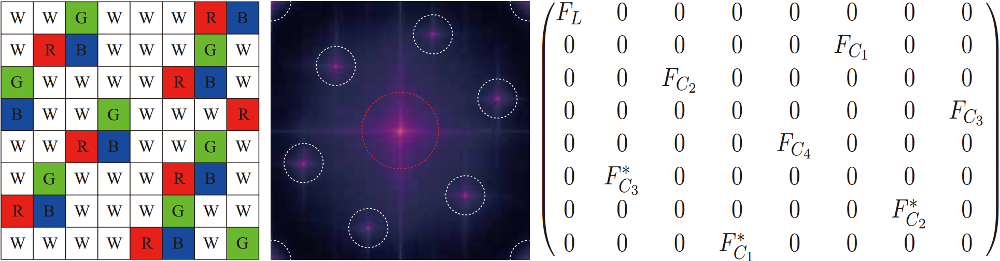

# Differentiable Optimization for Designing RGBW Color Filter Arrays in the Frequency Domain

---

**Yuhao Wang, Dongran Wang, Jianxin Ren and Chenyan Bai**

> Although frequency-domain designs theoretically reduce spectral aliasing, optimizing RGBW color filter arrays (CFAs) remains challenging. Generating candidates in the spatial domain for subsequent frequency-domain evaluation suffers from an exponentially growing search space, while direct frequency-domain design using the inverse Fourier transform fails to guarantee strict RGBW CFAs, often resulting in RGB mixtures. In this letter, we propose a differentiable optimization method for RGBW CFA design in the frequency domain. We introduce differentiable surrogate functions that relax the discrete RGBW channel selection into a differentiable formulation, and transform the valid frequency distances into energy-weighted distances over all possible frequency positions. We further incorporate these surrogate functions, along with a likelihood measure of white (W) pixels and an internal periodicity penalty, into the loss function and optimize it using the Adam optimizer. Using this method, we obtain the SD8 CFA, a novel $`8\times 8`$ RGBW CFA with 62.5% W pixels and no spectral aliasing. Experiments confirm that our SD8 CFA outperforms several representative RGBW CFAs under varying lighting conditions.

---

## Differentiable Optimization for RGBW CFA Design

Designing a *strict* RGBW CFA in the frequency domain is difficult: spatial search grows exponentially (e.g. `4^64` candidates for an `8x8` pattern), while automatic frequency-domain design followed by inverse DFT often yields mixed RGB responses that are not physically realizable.

The paper therefore optimizes the CFA with a **differentiable surrogate** pipeline (Adam, PyTorch):

### 1. Relax channel selection

Each pixel holds a learnable RGB logit vector, mapped by temperature-softmax to a probability on the 3-simplex. Temperature is annealed so the distribution gradually hardens toward a discrete assignment.

### 2. Differentiable surrogate functions

We avoid using the symbolic DFT and its inverse, because isolating only the nonzero frequency sites makes the process non-differentiable. Instead, we apply a standard (fully differentiable) 2D DFT to the continuous RGB probability maps

$$
H = \left( \mathrm{DFT}(\boldsymbol{p}^{(R)}), \mathrm{DFT}(\boldsymbol{p}^{(G)}), \mathrm{DFT}(\boldsymbol{p}^{(B)}) \right),
$$

where $H(0,0)$ is the luminance component $F_L$ and all other bins are chrominance components $F_C$.
Let $q=(\frac{i}{H},\frac{j}{W})$ be a frequency site and $E(q)=\|H(q)\|_2$ its chrominance energy. We replace hard min-distances over *valid* sites by **energy-weighted soft distances** over *all* sites. With normalized weights

$$
\alpha_q = \frac{E(q)^{\gamma}}{\sum_{q'} E(q')^{\gamma} + \epsilon},
$$

the surrogates of the luminance-chrominance distance $`\tilde{s}_1`$ and the chrominance-chrominance distance $`\tilde{s}_2`$ are

$$
\tilde{s}_1 = -\tau_s \log\left( \sum_{q} \alpha_q \exp\left(-\frac{d(q,0)}{\tau_s}\right) + \epsilon \right),
$$

$$
\tilde{s}_2 = -\tau_s \log\left( \sum_{a < b} \sqrt{\alpha_{q_a}\alpha_{q_b}} \exp\left(-\frac{d(q_a,q_b)}{\tau_s}\right) + \epsilon \right),
$$

where $d(\cdot,\cdot)$ is the toroidal Euclidean distance on the frequency torus, $`\gamma`$ emphasizes high-energy bins, and $`\tau_s`$ controls how closely the soft-min matches the true minimum. A balance term prevents one distance from dominating the other:

$$
\tilde{s}_{\mathrm{bal}} = -\tau_b \log\left( \exp\left(-\frac{\tilde{s}_1}{\tau_b}\right) + \exp\left(-\frac{\tilde{s}_2}{\tau_b}\right) \right).
$$

Gradients then flow end-to-end through DFT without symbolic IDFT or discrete site selection.

### 3. Loss terms

The objective combines the frequency-distance surrogates from above with regularizers:

- $`\tilde{s}_1`$ and $`\tilde{s}_2`$ encourage luminance-chrominance and chrominance-chrominance separation (to be maximized).
- $`\tilde{s}_{\mathrm{bal}}`$ is a soft-min balance of $`\tilde{s}_1`$ and $`\tilde{s}_2`$, so that optimization cannot overemphasize one distance at the expense of the other.
- $`\mathcal{L}_W`$ encourages a sufficient proportion of W pixels.
- $`\mathcal{L}_{RGB}`$ ensures each RGB channel appears at least once.
- $`\mathcal{L}_{period}`$ penalizes internal periodicity (tiling by a smaller sub-pattern).
- $`\mathcal{H}`$ is the entropy of the per-pixel softmax for early exploration.

The total loss is

$$
\mathcal{L} = -\tilde{s}_1 - \tilde{s}_2 - \lambda_{\mathrm{bal}}\tilde{s}_{\mathrm{bal}} + \lambda_e\mathcal{H} + \lambda_p\mathcal{L}_{period} + \lambda_c\mathcal{L}_{RGB} + \lambda_w\mathcal{L}_W,
$$

where $`\lambda_{\mathrm{bal}}`$, $`\lambda_e`$, $`\lambda_p`$, $`\lambda_c`$, and $`\lambda_w`$ are weighting coefficients.

### 4. Discretization

After optimization, project each pixel to W if close to $`(\frac{1}{3},\frac{1}{3},\frac{1}{3})`$, otherwise to the RGB channel with max probability. This yields a **strict** RGBW pattern.

---

## Proposed SD8 CFA




**SD8** is an `8x8` RGBW CFA obtained by the method above. It contains **62.5%** W pixels, adopts a stepped-diagonal RGB arrangement with an RB-paired structure, and exhibits no spectral aliasing, with both $`s_1`$ and $`s_2`$ reaching **0.3536**.

---

## LSLCD Algorithm

**LSLCD** (Least-Squares Luma-Chroma Demultiplexing) is a frequency-selection demosaicking method. A mosaicked CFA image is modeled as a baseband luminance component plus modulated chrominance components. Adaptive FIR filters estimate the chrominance bands in the least-squares sense from training data; the estimated luma/chroma are then demultiplexed back to RGB.

This package generalizes the original Bayer LSLCD pipeline to **arbitrary CFA size and an arbitrary number of chrominance components**, so the same leave-one-out training/evaluation code can compare RGBW patterns such as SD8 and the baselines. In each fold, filters (size `21x21`) are learned on all images except the test image; CPSNR is computed against the noise-free ground-truth RGB.

```bibtex
@ARTICLE{5696756,
  author={Leung, Brian and Jeon, Gwanggil and Dubois, Eric},
  journal={IEEE Transactions on Image Processing},
  title={Least-Squares Luma-Chroma Demultiplexing Algorithm for Bayer Demosaicking},
  year={2011},
  volume={20},
  number={7},
  pages={1885-1894},
  doi={10.1109/TIP.2011.2107524}
}
```
---

## Experiment Results

All CFAs are demosaicked with the same LSLCD pipeline (filter size `21x21`, leave-one-out training, no boundary crop). Higher is better. Best per row in **bold**.

| Scene | Dataset | Binning<br>25% | Kodak<br>50% | Honda<br>50% | Hamilton<br>50% | Sony<br>50% | Yamagami<br>50% | Kaizu<br>50% | Luo<br>69% | **SD8**<br>62.5% |
|---|---|---:|---:|---:|---:|---:|---:|---:|---:|---:|
| Normal-light | Kodak | 31.79 | 34.16 | 35.66 | 32.00 | 35.46 | 35.46 | 35.35 | 35.52 | **36.42** |  
| Normal-light | CAVE | 34.82 | 37.23 | 39.19 | 33.56 | 39.21 | 39.13 | 39.42 | 38.10 | **39.82** |
| Low-light | Gehler-Shi | 34.36 | 35.33 | 35.28 | 34.56 | 35.65 | 35.41 | 35.66 | 33.02 | **36.35** |
| Low-light | CAVE | 40.31 | 41.54 | 42.17 | 39.32 | 42.45 | 42.30 | 42.50 | 42.31 | **42.99** |
| Extremely low-light | Gehler-Shi | 29.47 | 30.64 | 30.59 | 30.27 | 30.78 | 30.67 | 30.79 | 30.45 | **31.63** |
| Extremely low-light | CAVE | 43.72 | 44.61 | 44.90 | 43.12 | 45.15 | 45.03 | 45.18 | 45.34 | **45.66** |

---

## Directory Layout

```
LSLCD_demosaicking/
|-- demo_chromas_parallel.py   # Parallel leave-one-out demosaicking (main entry)
|-- demo_chromas.py            # Sequential version of the same pipeline
|-- generic_pipeline.py        # Dataset loading, mosaicking, LSLCD, CPSNR
|-- common.py                  # I/O helpers, CFA load/save, path roots
|-- CFAs/                      # Precomputed CFA definitions (*.mat)
|-- dataset/
|   |-- kodak/                 # Kodak (24 PNG images)
|   +-- low_light/             # Gehler-Shi RGB subset (10 PNG images)
|-- CAVE_D65_Raw/              # CAVE normal-light RGBW (.mat)
|-- CAVE_D65_Lowlight/         # CAVE low-light RGBW inputs
|-- CAVE_D65_Lowlight_Raw/     # CAVE low-light RGBW references (noise-free)
|-- CAVE_D65_Extreme_Lowlight/
|-- CAVE_D65_Extreme_Lowlight_Raw/
|-- figure/                    # Optional figures for this README
|-- command.sh                 # Example batch commands
|-- requirements.txt
+-- README.md
```

Runtime outputs go to `results/<dataset_name>/<cfa_name>/` (not shipped).

---

## Setup

```bash
pip install -r requirements.txt
```

Run all commands from the package root (`LSLCD_demosaicking/`).

---

## Datasets

Three source collections form six evaluation settings under three illumination levels.

| Source | Link | Local path |
|---|---|---|
| Kodak | [r0k.us/graphics/kodak](https://r0k.us/graphics/kodak/) | `dataset/kodak` (24 RGB PNGs) |
| CAVE | [cave.cs.columbia.edu](https://cave.cs.columbia.edu/repository/Multispectral) | `CAVE_D65_*` RGBW mats (D65, camera sensitivities) |
| Gehler-Shi | [shi_gehler](https://www2.cs.sfu.ca/~colour/data/shi_gehler/) | `dataset/low_light` (10 RGB PNGs, sampled as in the paper) |

### CLI names (`--dataset_name`)

| Name | Source | Illumination | How this package builds inputs |
|---|---|---|---|
| `kodak` | `dataset/kodak` | Normal | Clean RGB; mosaick on RGB |
| `cave_normal` | `CAVE_D65_Raw` | Normal | Clean RGB from RGBW mats |
| `low_light` | `dataset/low_light` | Low | On load: `W=(R+G+B)/3`, Gaussian noise on RGB (`sigma=5.0`) and W (`sigma=5/3`); mosaick on noisy RGBW; CPSNR vs clean RGB |
| `cave_lowlight` | `CAVE_D65_Lowlight` + `_Raw` | Low | Precomputed Poisson-noisy RGBW input; noise-free Raw as GT |
| `extreme_lowlight` | `dataset/low_light` (same files) | Extreme | Same as `low_light` but RGB `sigma=10.0`, W `sigma=10/3` |
| `cave_extreme_lowlight` | `CAVE_D65_Extreme_Lowlight` + `_Raw` | Extreme | Precomputed Poisson-noisy RGBW input; noise-free Raw as GT |

### Illumination simulation details

- **Normal-light**  
  Kodak / `cave_normal`: no extra noise.

- **Low-light**  
  - Gehler-Shi (`low_light`): at dataset load, independent Gaussian noise on RGB (`std=5.0`) and W (`std=1.67`). Training and testing both mosaick the noisy RGBW; metrics use noise-free RGB.  
  - CAVE (`cave_lowlight`): Poisson noise on spectral bands (peak photon counts RGB/W = 75/120, intensity scale `0.35`). Inputs in `CAVE_D65_Lowlight`; GT in `CAVE_D65_Lowlight_Raw`.

- **Extreme low-light**  
  - Gehler-Shi (`extreme_lowlight`): same as `low_light` with RGB `std=10.0`, W `std=3.33`.  
  - CAVE (`cave_extreme_lowlight`): Poisson noise with peaks RGB/W = 30/55, scale `0.18`.

---

## CFA Assets

Load with `--cfa_name <name>` -> `CFAs/cfa_<name>.mat`.

| CFA name | File | Role |
|---|---|---|
| Binning | `cfa_bining.mat` | Baseline |
| Kodak | `cfa_compton.mat` | Baseline |
| Honda | `cfa_honda.mat` | Baseline |
| Hamilton | `cfa_hamilton.mat` | Baseline |
| Sony | `cfa_sony.mat` | Baseline |
| Yamagami | `cfa_yamagami.mat` | Baseline |
| Kaizu | `cfa_kaizu.mat` | Baseline |
| Luo | `cfa_luo.mat` | Baseline |
| SD8 | `cfa_SD8.mat` | Proposed CFA (paper) |

Note: the paper's "Kodak" CFA refers to the Compton RGBW pattern. This package currently ships the mats listed under [CFA Assets](#cfa-assets); add `cfa_compton.mat` if you need that baseline locally.

---

## Usage

```bash
# Parallel evaluation (default: --workers = CPU count - 1)
python demo_chromas_parallel.py --cfa_name SD8 --dataset_name kodak --workers 8

# Sequential evaluation
python demo_chromas.py --cfa_name SD8 --dataset_name kodak

# Gehler-Shi low-light / extreme low-light (noise applied in code)
python demo_chromas_parallel.py --cfa_name SD8 --dataset_name low_light --workers 8
python demo_chromas_parallel.py --cfa_name SD8 --dataset_name extreme_lowlight --workers 8

# CAVE examples
python demo_chromas_parallel.py --cfa_name SD8 --dataset_name cave_normal --workers 8
python demo_chromas_parallel.py --cfa_name SD8 --dataset_name cave_lowlight --workers 8
python demo_chromas_parallel.py --cfa_name SD8 --dataset_name cave_extreme_lowlight --workers 8
```

Each run:

1. Leave-one-out training / testing over the dataset  
2. Prints per-image CPSNR and the average CPSNR  
3. Saves reconstructions and `log.txt` under `results/`

See `command.sh` for more CFA / dataset combinations.

---

## Contact

If you have any questions, please contact cybai@cnu.edu.cn